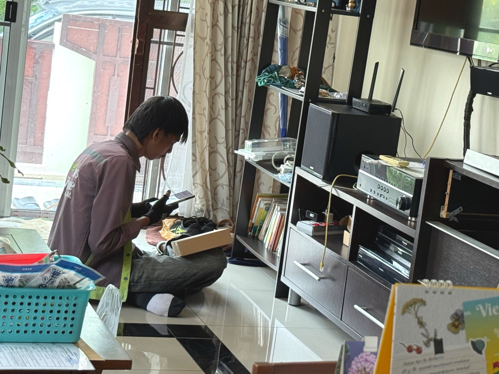
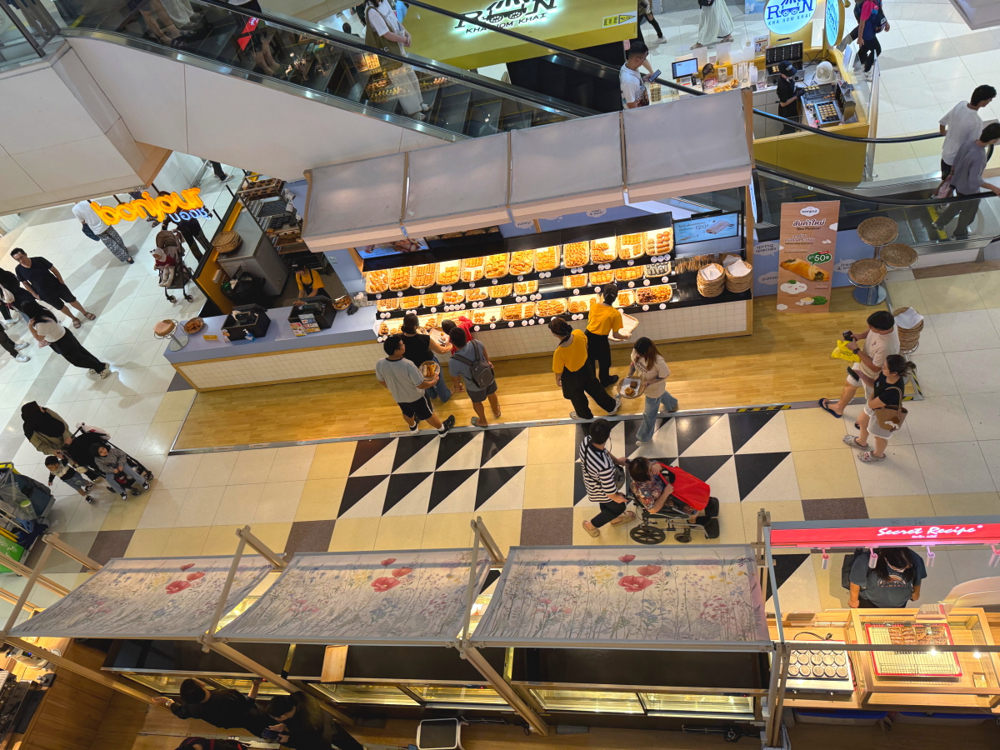
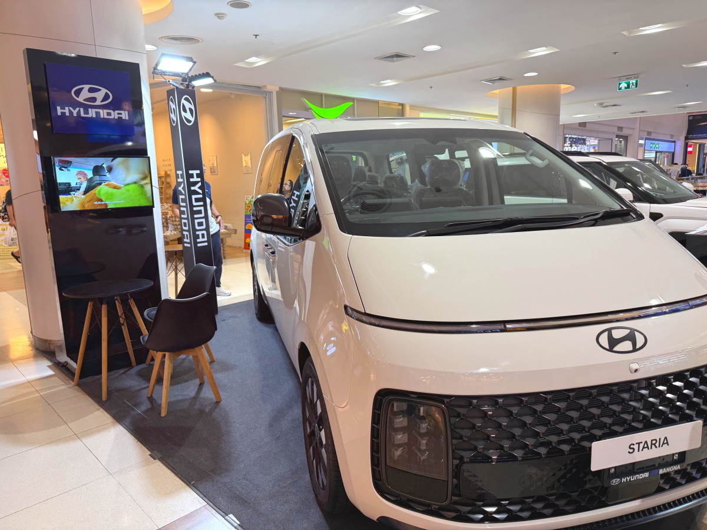
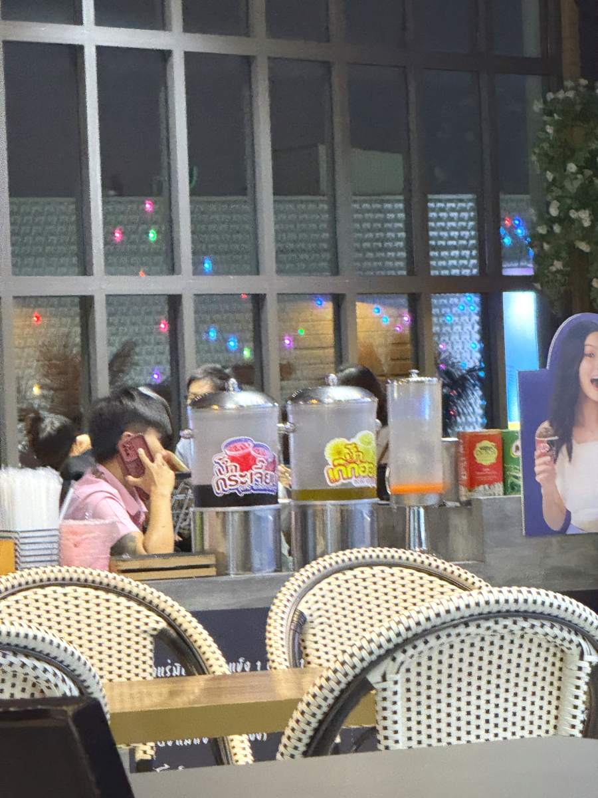
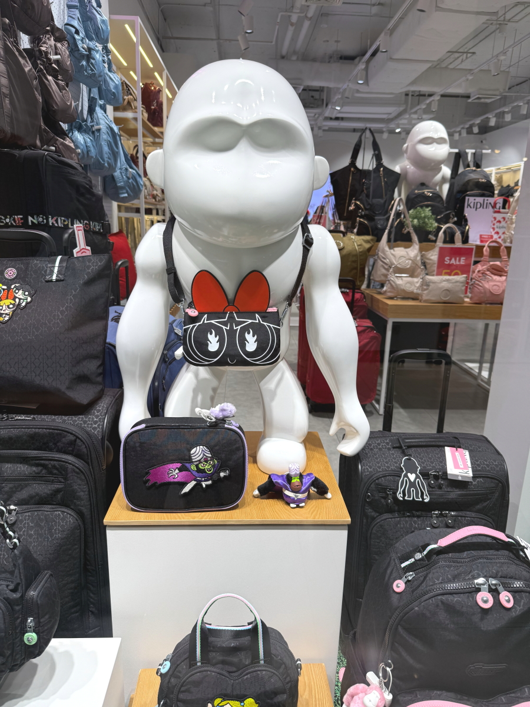

# 20250914_bangkok

<html lang="ja" data-loaded="false" data-scrolled="false" data-spmenu="closed">
<head>

<meta charset="UTF-8">
<meta http-equiv="Content-Type" content="text/html; charset=UTF-8">
<meta http-equiv="X-UA-Compatible" content="IE=EmulateIE10" />
<meta http-equiv="X-UA-Compatible" content="IE=edge">

<meta name="viewport" content="width=device-width, initial-scale=1.0">

<!--ここから上はお決まりの定型文です-->

<!--ここからが表現の書式などを決めるcssという部分-->

<link href="https://cdnjs.cloudflare.com/ajax/libs/lightbox2/2.7.1/css/lightbox.css" rel="stylesheet">

</head>

<body>

モバイル端末をお使いの場合は、画面を横向きにすると
背景画像の横方向がご覧頂けます。

<!--ここ上は、ほぼそのまま使います！-->

<!--QRコードの挿入例-->

 アクセス用QRコード

<marquee direction="left" scrollamount="20" width="30%">(^_^)/~alis</marquee>

<!--流れ文字の挿入例-->
<h1><marquee behavior="left">!!! 2025/09/12-14、Wi-Fi交換から、生垣のお花達まで!!!</marquee></h1>

                          

<!--ここから下が、本体部分-->
    

 
<h2>12日、Wi-Fiの接続が頻繁に切れるので、ルーター点検</h2>

    
<h2>無料交換で新品になりました</h2>

    
<h2>水道業者のおじさんの車、無線のアンテナが2本も立ってます</h2>

    
<h2>ショッピングモールの4階まで上がるエスカレータ、各フロアでは、次のエスカレータまで行くのにフロアを歩かせる設計</h2>

    
<h2>エスカレータで上りながら1階の屋台を見下ろしたところ</h2>

    
<h2>4階のフードコートで夕ご飯</h2>

    
<h2>金曜の18:30ですが空いてました</h2>

    
<h2>この日は、目玉焼きのせエビチャーハン</h2>

    
<h2>食後はエスカレータで1階まで降ります</h2>

    
<h2>エスカレータホールには気球のオブジェ</h2>

    
<h2>1階のLotus`sでお買い物</h2>

    
<h2>入り口脇には宝くじ売りのお姉さん</h2>

    
<h2>為替チェック、円が暴落中</h2>

    
<h2>センターホールでは自動車各社が展示会中</h2>

    
<h2>夜のデザートはLotus'sで買ったドリアン</h2>

    
<h2>13日、朝は晴れて、生垣のお花達が輝きました</h2>

    
<h2>仏壇はいつものように綺麗に飾られています</h2>

    
<h2>暑さが和らいだので、昼過ぎにも町内を散策</h2>

    
<h2>週に一度のごみ収集車が来ますが、その向こうには入道雲、昼過ぎにはスコールが来ました</h2>

    
<h2>木のお花も見事に満開</h2>

    
<h2>電線の上をリスが駆け抜けます</h2>

<h2>リスが駆け抜ける動画↓</h2>

<iframe width="560" height="315" src="https://www.youtube.com/embed/oOMcgYWuq3g?si=fHhtEb7iHEFNM6Y-" title="YouTube video player" frameborder="0" allow="accelerometer; autoplay; clipboard-write; encrypted-media; gyroscope; picture-in-picture; web-share" referrerpolicy="strict-origin-when-cross-origin" allowfullscreen></iframe>
    

    
<h2>お昼にもドリアン、美味しすぎてクセになります</h2>

    
<h2>ショッピングモールのトイレに入ると、トイレットペーパーを便器に流せることになってました 普通のタイ人は便器横のボミ箱にティッシュを捨てるので、今からPR展開中ですね〜</h2>

    
<h2>旅行会社のイベント用、特製スーツケース</h2>

    
<h2>電気コーナーで冷蔵庫を物色しました</h2>

    
<h2>こちらがいつも買うドリアン</h2>

    
<h2>2日続けて、4階のフードコート、外の眺めが壮観！</h2>

    
<h2>近くの席で白人さんが食事しながら大演説</h2>

    
<h2>この日は焼きそば定食でした</h2>

    
<h2>窓の外のイルミネーションが綺麗でしたが、スマホではイマイチです</h2>

    
<h2>４種類の楽器を教える、音楽教室のポスター</h2>

    
<h2>中央エントランスを下ります</h2>

    
<h2>日曜のイベント準備中</h2>

    
<h2>家電量販店でも冷蔵庫を物色</h2>

    
<h2>お店のおじさん、一生懸命サイズを測ってくれます、ミラードアにお顔が写りました</h2>

    
<h2>バック屋さんのオブジェが独特</h2>

    
<h2>明日のイベント準備が終わったお姉様達が、エントランスの階段で記念撮影</h2>

    
<h2>午後の入道雲も抜けさって、雨上がりの街を帰路につきます</h2>

    
<h2>Fitに極太タイヤ、オーバーフェンダーつけるのはまともな方で、普通はタイヤはみ出させちゃってますがそれも合法らしい</h2>

    
<h2>14日、朝だけ作動する噴水</h2>

    
<h2>曇り空でしたが、お花達は皆満開！</h2>

         

<!--  
<h2>再掲【暑中お見舞い（ほたる）】LINEでご挨拶・動画で送る夏のグリーティングカード / ギターbgm/蛍の光・癒し動画</h2>

<iframe width="560" height="315" src="https://www.youtube.com/embed/Z4PKDOhRzfI?si=LaAJ8dA-1izGspEO" title="YouTube video player" frameborder="0" allow="accelerometer; autoplay; clipboard-write; encrypted-media; gyroscope; picture-in-picture; web-share" referrerpolicy="strict-origin-when-cross-origin" allowfullscreen></iframe>
    
   
-->   
    
    

  
<h2>今日のBGMは 素敵なエピソードを持つ【駅ピアノ/ストリートピアノ】で、X JAPAN／Forever Loveを弾いていたら駅員さんが予想外の行動にでてビックリ</h2>

<iframe width="560" height="315" src="https://www.youtube.com/embed/V2KLihFiKV8?si=Nb-TA_QUYYAlkWDE" title="YouTube video player" frameborder="0" allow="accelerometer; autoplay; clipboard-write; encrypted-media; gyroscope; picture-in-picture; web-share" referrerpolicy="strict-origin-when-cross-origin" allowfullscreen></iframe>
    

    
  
<h2>8月17日にメタバースで披露されたまいてゃさんの新曲「Lonely game」</h2>

<iframe width="560" height="315" src="https://www.youtube.com/embed/HstFJ2_8oQA?si=QrYNv_EcIm7fALkV" title="YouTube video player" frameborder="0" allow="accelerometer; autoplay; clipboard-write; encrypted-media; gyroscope; picture-in-picture; web-share" referrerpolicy="strict-origin-when-cross-origin" allowfullscreen></iframe>
    

    
    

    
    
    <h3>「雪の中で輝くシンデレラ」by まいてゃ</h3>
<h2><a href="https://torokoid.github.io/20250219_chiangrai/maitiyaz.mp3" target="_blank">この文字クリックで再生します 下の再生ボタンでも同じ曲をループ再生します</a></h2>

    <audio controls loop>
        <source src="https://torokoid.github.io/20250219_chiangrai/maitiyaz.mp3" type="audio/mpeg">
        お使いのブラウザは audio タグをサポートしていません。
    </audio>
 
    
<!--
  
<h2>スティーブ・ジョブズの伝説の講義</h2> 
<iframe width="560" height="315" src="https://www.youtube.com/embed/XsRpvWHIVw0?si=f7IA0pv9iZWVk3VH" title="YouTube video player" frameborder="0" allow="accelerometer; autoplay; clipboard-write; encrypted-media; gyroscope; picture-in-picture; web-share" referrerpolicy="strict-origin-when-cross-origin" allowfullscreen></iframe>    
    
    
<h2>スティーブ・ジョブズ氏の講義の内容が「笑って死ぬ」by まいてゃ さんの歌の内容と大筋で同じに聞こえます 以下に再掲しますね</h2>

    
<h3>歌の後半部分しか撮れてませんが、2月16日のイベントで公開された「笑って死ぬ」 by まいてゃ 白ドレスはダンサーの玖遠さん、黒いドレスがまいてゃさん</h3>
<iframe width="560" height="315" src="https://www.youtube.com/embed/s4ZcbxAluMM?si=Xa32xo19UCNaWv0v" title="YouTube video player" frameborder="0" allow="accelerometer; autoplay; clipboard-write; encrypted-media; gyroscope; picture-in-picture; web-share" referrerpolicy="strict-origin-when-cross-origin" allowfullscreen></iframe> 
-->
    

    <h3>お気に入りの「笑って死ぬ」 by まいてゃさんも再々掲です</h3>
<h2><a href="https://torokoid.github.io/20250221_chiangrai/maitiya3.mp3" target="_blank">この文字クリックで再生します 下の再生ボタンで同じ曲をループ再生します</a></h2>

    <audio controls loop>
        <source src="https://torokoid.github.io/20250221_chiangrai/maitiya3.mp3" type="audio/mpeg">
        お使いのブラウザは audio タグをサポートしていません。
    </audio>

   
<h2>以上、Wi-Fi交換から、生垣のお花達まででした。 ここまでご覧いただきありがとうございました。</h2>

     
<h2>
<a href="https://torokoid.github.io/Mashiko_himawari_3/" target="_blank">クリックでメニューページに戻ります</a>
</h2>

   

<!-- hitwebcounter Code START -->
<a href="https://www.hitwebcounter.com" target="_blank">

あなたは 番目の訪問者です 数値は8月1日以降に立ち上げたバンコクシリーズHPの累計です
</a>   

         

  

      

<!--本体はここまで-->

<!--画面に空白地帯を作って、背景が見えるようにしています-->
                                              

<!-- フッタ -->
<footer>

Copyright 2025/09/14 alis @Bangkok

</footer>

<!--HPにさまざまなJavaScriptを呼び込むための書式-->

    
    </body>
    
</html>
